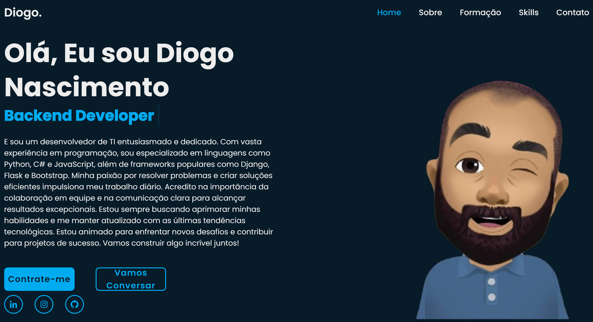

# Portifólio

Esse projeto é para mostrar o meu perfil e dizer as minhas habilidades como desenvolvedor.

## Screenshots

## 🚀 Sobre mim
E sou um desenvolvedor de TI entusiasmado e dedicado. Com vasta experiência em programação, sou especializado em linguagens como Python, C# e JavaScript, além de frameworks populares como Django, Flask e Bootstrap. Minha paixão por resolver problemas e criar soluções eficientes impulsiona meu trabalho diário. Acredito na importância da colaboração em equipe e na comunicação clara para alcançar resultados excepcionais. Estou sempre buscando aprimorar minhas habilidades e me manter atualizado com as últimas tendências tecnológicas. Estou animado para enfrentar novos desafios e contribuir para projetos de sucesso. Vamos construir algo incrível juntos!

## Aprendizados

O que você aprendeu construindo esse projeto? Quais desafios você enfrentou e como você superou-os?

## Stack utilizada

**Front-end:** React, Redux, TailwindCSS

**Back-end:** Node, Express

## 🛠 Habilidades
Javascript, HTML, CSS...

## Stack utilizada

**Front-end:** HTML, CSS, JavaScript

**Back-end:** Python, Flask

## Feedback

Se você tiver algum feedback, por favor nos deixe saber por meio de diogonascimentobraga@gmail.com

